 

# Hi, I'm Gorkem

### Co-Founder & CTO at [Privent.ai](https://privent.ai)

  <em>Building the security layer for agentic AI pipelines</em>

 

  
  &nbsp;
  
  &nbsp;
  

 

<h3><code>gorkem@github ~ $ whoami</code></h3>

<picture>
  <source media="(prefers-color-scheme: dark)" srcset="assets/info-card.svg" />
  
</picture>

 

<h3><code>gorkem@github ~ $ ./contributions.sh</code></h3>

<picture>
  <source media="(prefers-color-scheme: dark)" srcset="assets/contrib-heatmap.svg" />
  
</picture>

## What I'm Building

At **[Privent.ai](https://privent.ai)** I'm building what we call the **Cloudflare for AI agent infrastructure**.

A universal security layer that intercepts prompts, embeddings and tool calls flowing through agentic pipelines, detects sensitive data leakage in real time and gives enterprises the audit trail they need to actually deploy AI in production.

 

## Beyond Privent

5+ years building products end to end. Frontend-heavy by background but I ship across the full stack and increasingly across ML infrastructure too.

Independently launched several SaaS products including **Navoo AI**, **BrifAI** and **Seonly**, which keeps me close to the realities of building, not just architecting.

 

###### Building the future of secure AI systems

Open to conversations about agentic AI security, LLM data leak prevention and founder engineering.

**[gorkem@privent.ai](mailto:gorkem@privent.ai)**

